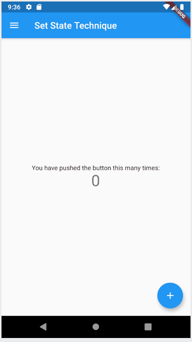

# Flutter State Management App

The idea is creating an App for Learning Flutter State Management. So, we will have multiple examples written into the same app.

So, who ever wants to understand State Management, can review the code and understand further.

Feel free to Pull the code and adding changes. 

# So far, below state management techniques are covered. 

1) SetState
2) Inherited Widget
3) Provider 

App output here:

[]

# Vision:

An App with all state management techniques into one place. Who ever want to learn, can simply review the code and understand. 

Multiple examples in each space.

